# 🎮 Pixel Developer Portfolio & Workshop

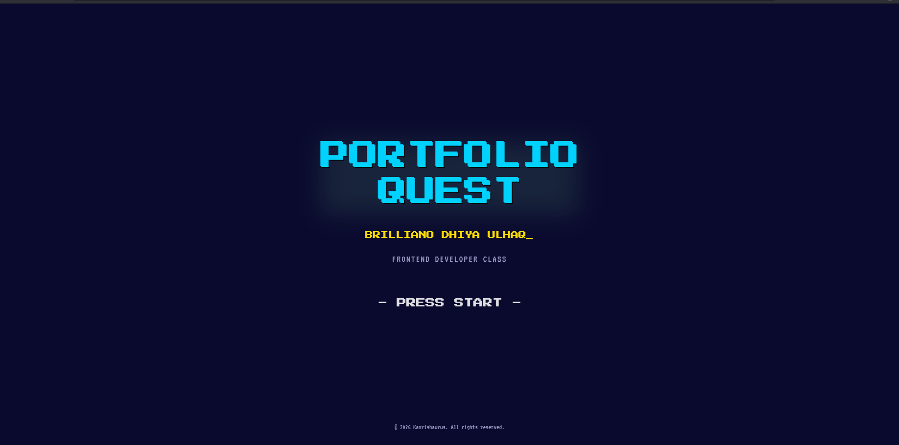

A legendary, ultra-premium **8-Bit Retro Gaming & Developer Utility Hub** built using React, Vite, and Supabase. This isn't just a portfolio—it's a fully interactive RPG retro game, a multi-game arcade cabinet, and a robust suite of developer tools combined into one sleek, highly responsive experience.

---

## 🌟 Core Highlights

*   **🎮 Interactive 8-Bit RPG Overworld**: Customise your pixel avatar and explore an interactive grid map.
*   **🏆 Quest & Achievement System**: Live Quest tracker, RPG-style Skill Tree, and dynamic Achievement popups.
*   **🕹️ Retro Arcade Cabinet**: 6 fully playable classic retro games built directly into the site.
*   **🛠️ Developer Workshop Suite**: Client-side tools for background removal, sprite sheet extraction, Mermaid diagrams, whiteboard sketching, PDF filling, and more.
*   **🔮 Gacha Summon System**: Roll banners (boys, girls, Uma) with authentic retro gacha roll animations and collection trackers.
*   **📊 Dynamic Commit Sync**: GitHub & GitLab contribution logs synced and displayed in a customized retro commit graph.
*   **🎵 8-Bit Chiptune Player**: Nostalgic custom media player to listen to retro loops while exploring.
*   **🔑 Easter Eggs**: Integrated Konami Code trigger (`↑ ↑ ↓ ↓ ← → ← → B A`) to unlock secret easter eggs and access the Secret Dungeon!

---

## 📸 Screenshots & Previews

Here is a sneak peek at the interactive developer overworld, the Hub world themes, and custom utility tools in action:

### 🎮 Retro UI & Landing Overworld
This portfolio features two distinct aesthetic modes (Normal & Alter) that completely shift the retro theme!

| ☀️ Normal Theme | 🌙 Alter Theme |
| :---: | :---: |
|  | 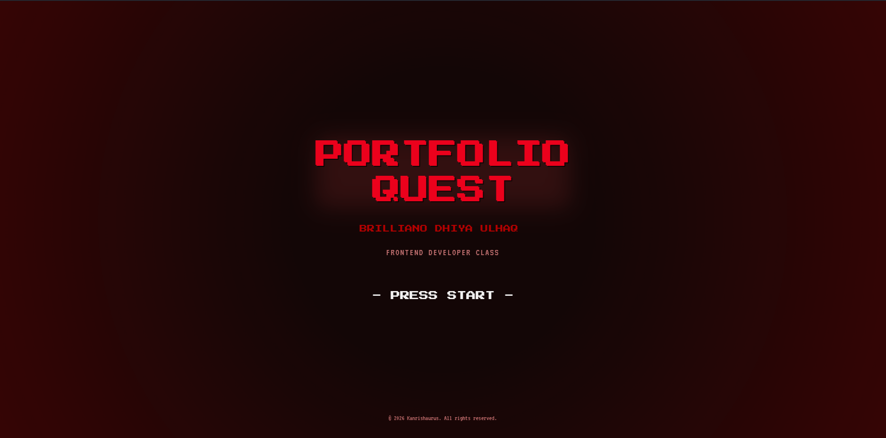 |

### 🏰 The Hub (Interactive Character Overworld)
Walk around and explore the interactive pixel-art overworld map, rendered beautifully in both styles!

| ☀️ Normal Hub | 🌙 Alter Hub |
| :---: | :---: |
| 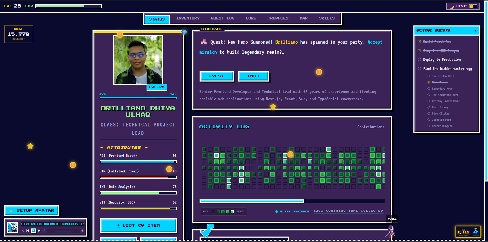 | 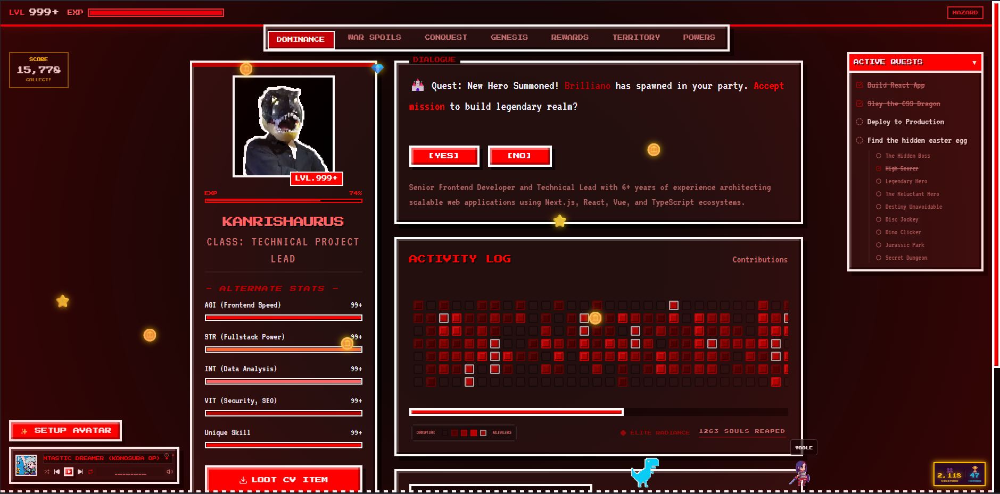 |

### 👾 Dynamic Custom Sprite Previews
Experience a dynamic, interactive overworld where guest players can customize, spawn, and display their own retro pixel characters in real-time (e.g., `YOOLE` exploring the world next to the classic blue pixel dino):

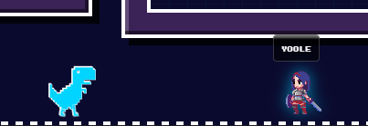

---

## 🕹️ Interactive Features

### 1. RPG & Gamification
*   **Avatar World**: Choose or customize your retro sprite. Use on-screen controls or keyboard navigation to wander around the interactive canvas overworld.
*   **Skill Tree**: An interactive, branch-based skill graph that acts as a visual representation of your technical stack. Spend "experience points" to unlock skills!
*   **Konami Code**: Classic arcade cheat input is listened to globally. Try entering the code on your keyboard to trigger a visual overlay and reveal the path to the **Secret Dungeon**.

### 2. Retro Arcade Games
Play six different, beautifully stylized games built from scratch with pure React state or canvas logic:
*   **Tetris**: Block dropping, line-clearing, high-score tracking puzzle.
*   **Snake**: Custom speed levels and retro sounds.
*   **Sudoku**: Difficulty-tuned interactive grid.
*   **Bubble Blast**: Classic bubble launcher with path guidance.
*   **Candy Match**: Standard Match-3 tile swap mechanics with scoring.
*   **Arcade Shooter**: Space invaders-inspired space shooter with firing and enemy wave logic.

### 3. Developer Workshop Suite
A toolbox containing useful client-side developer utility products:
*   **Background Remover**: Removes image backgrounds fully offline inside the browser using `@imgly/background-removal`.
*   **Sprite Sheet Generator**: Extract animations, split sprite grids, or package sequences. (Still Developing)
*   **Mermaid Live Editor**: Write, preview, and export clean software diagrams.
*   **Vector Whiteboard**: Smooth sketching tool for brainstorming and workflows.
*   **YouTube Tool**: Download thumbnails, view video information, or stream audio. (Still Developing)
*   **PDF Filler**: Fill out, edit, and export PDF sheets client-side.
*   **Color Utility**: Custom HSL, HEX palette builder, and contrast checker.

---

## 🚀 Tech Stack

- **Framework**: [React 19](https://react.dev/) + [Vite](https://vite.dev/) (Standalone Fast Build)
- **Language**: [TypeScript](https://www.typescriptlang.org/)
- **Styling**: [TailwindCSS v4](https://tailwindcss.com/) + CSS Variables
- **Animations**: [Framer Motion](https://www.framer.com/motion/)
- **Database / Backend**: [Supabase](https://supabase.com/) (Realtime, Auth, SQL Functions)
- **Icons**: [Lucide React](https://lucide.dev/)
- **Diagnostics & Monitoring** (I'm just trying grafana for explore the tools, since my portfolio is simple, so I don't need this actually): [Grafana Faro SDK](https://grafana.com/oss/faro/)

---

## 🛠️ Local Installation & Setup

### Prerequisites
*   [Node.js](https://nodejs.org/) v18+ or v22 (recommended)
*   [npm](https://www.npmjs.com/) or [Bun](https://bun.sh/)

### Steps
1.  **Clone the Repository**:
    ```bash
    git clone https://github.com/brillianodhiya/Brilliano-8bit-Portofolio.git
    cd Brilliano-8bit-Portofolio
    ```
2.  **Install Dependencies**:
    ```bash
    npm install
    # or if you use Bun
    bun install
    ```
3.  **Configure Environment Variables**:
    Copy the example env file and insert your API keys:
    ```bash
    cp .env.example .env
    ```
    Open `.env` and enter your credentials:
    ```env
    VITE_SUPABASE_URL=your_supabase_project_url
    VITE_SUPABASE_ANON_KEY=your_supabase_anonymous_key
    SUPABASE_SERVICE_ROLE_KEY=your_supabase_service_role_key (Only required locally if running sync scripts)
    GH_PAT=your_github_personal_access_token
    GITLAB_TOKEN=your_gitlab_access_token (optional)
    GITLAB_USER_ID=your_gitlab_user_id (optional)
    ```
4.  **Run Development Server**:
    ```bash
    npm run dev
    # or
    bun run dev
    ```
5.  **Build for Production**:
    ```bash
    npm run build
    ```

---

## 🗄️ Supabase Setup & RLS Policies

To enable the interactive **Visitor Counter** and store records successfully, log into your Supabase Console, open the SQL Editor, and execute the following:

### 1. Database Schema
```sql
-- Create visitor counter table
create table page_visits (
  id uuid default gen_random_uuid() primary key,
  page_name text unique not null,
  hit_count bigint default 0
);

-- Insert starting point for home page
insert into page_visits (page_name, hit_count) values ('home', 0);

-- Create portfolio contribution activity log
create table portfolio_activity_log (
  id uuid default gen_random_uuid() primary key,
  date date unique not null,
  count integer default 0,
  updated_at timestamp with time zone default timezone('utc'::text, now()) not null
);
```

### 2. Visitor Increment Function
```sql
create or replace function increment_visitor_count(page_identifier text)
returns void as $$
begin
  insert into page_visits (page_name, hit_count)
  values (page_identifier, 1)
  on conflict (page_name)
  do update set hit_count = page_visits.hit_count + 1;
end;
$$ language plpgsql security definer;
```

### 3. Security (RLS) Configuration
Enable Row Level Security and configure access:
```sql
alter table page_visits enable row level security;
alter table portfolio_activity_log enable row level security;

-- Public read-only policy for stats
create policy "Allow public read-only access"
  on page_visits for select using (true);

-- Public read-only policy for activity log
create policy "Allow public read-only access on activity log"
  on portfolio_activity_log for select using (true);
```

---

## 🔄 Automated Activity Logging (GitHub Actions)

This repository includes a scheduled cron runner that automatically pulls your daily contribution stats from GitHub (and GitLab) and records them in your Supabase database to keep the retro commit graph up-to-date.

The script runs automatically every night at `17:15 UTC` (00:15 WIB).

### Setup Secret Tokens in GitHub
In your GitHub Repository, navigate to **Settings** > **Secrets and variables** > **Actions** and add these Secrets:
*   `SUPABASE_URL`: Your Supabase Project API URL.
*   `SUPABASE_SERVICE_ROLE_KEY`: Service Role Key (needed to bypass RLS write restrictions securely in backend environments).
*   `GH_PAT`: GitHub Personal Access Token (with `read:user` and `repo` scopes).
*   `GITLAB_TOKEN` (Optional): GitLab access token.
*   `GITLAB_USER_ID` (Optional): GitLab User ID.

The action details are located in [.github/workflows/sync.yml](.github/workflows/sync.yml).

---

## 🎵 Special Thanks & Music Credits

A very special thank you to the creators of the nostalgic 8-bit chiptune background loops used in this project:

| Cover Art | Song Title | Original Link / Creator |
| :---: | :--- | :--- |
| 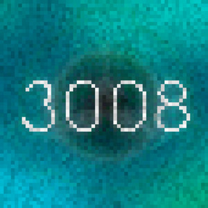 | **3008's Friday Theme (Crunchy)** | [Watch on YouTube](https://www.youtube.com/watch?v=r7vxapkY2yg) |
| 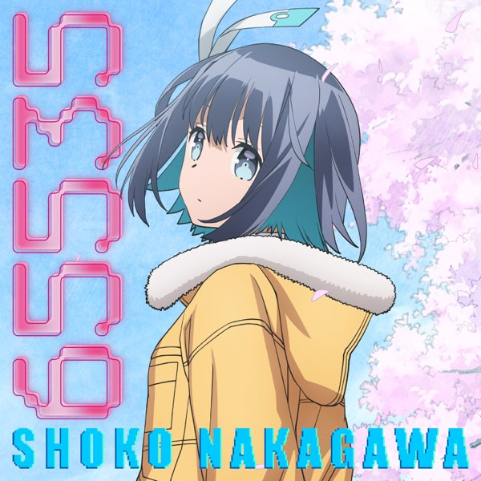 | **Shoko Nakagawa - 65535 (8-bit)** | [Watch on YouTube](https://www.youtube.com/watch?v=6xXu0cneaSY) |
| 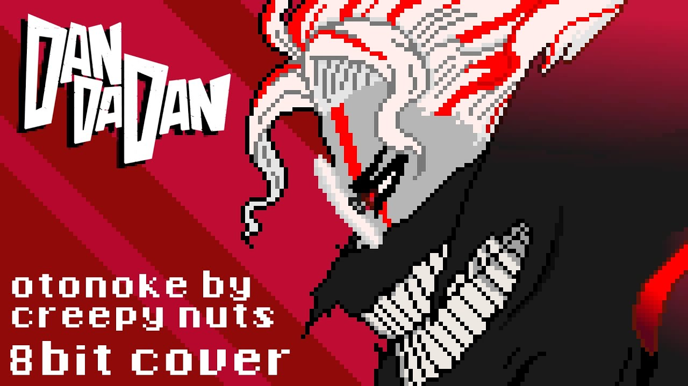 | **DAN DA DAN - Otonoke (8-bit)** | [Watch on YouTube](https://www.youtube.com/watch?v=CEc84WF0MDU) |
| 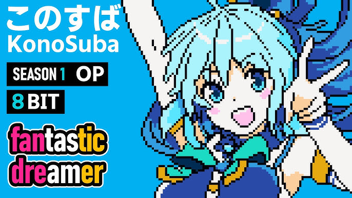 | **Fantastic Dreamer (Konosuba OP)** | [Watch on YouTube](https://www.youtube.com/watch?v=TFpGRnfc4AM) |
| 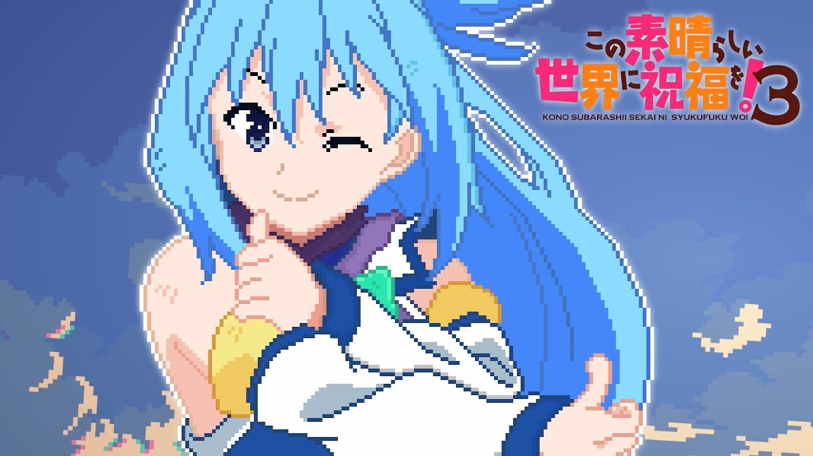 | **Growing Up (Konosuba S3 OP)** | [Watch on YouTube](https://www.youtube.com/watch?v=spxuYTGnn4U) |
| 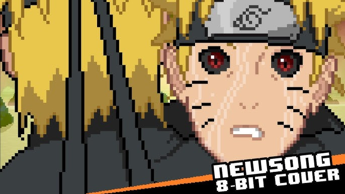 | **Newsong (Naruto OP 10)** | [Watch on YouTube](https://www.youtube.com/watch?v=v-IajUGR2OU) |
| 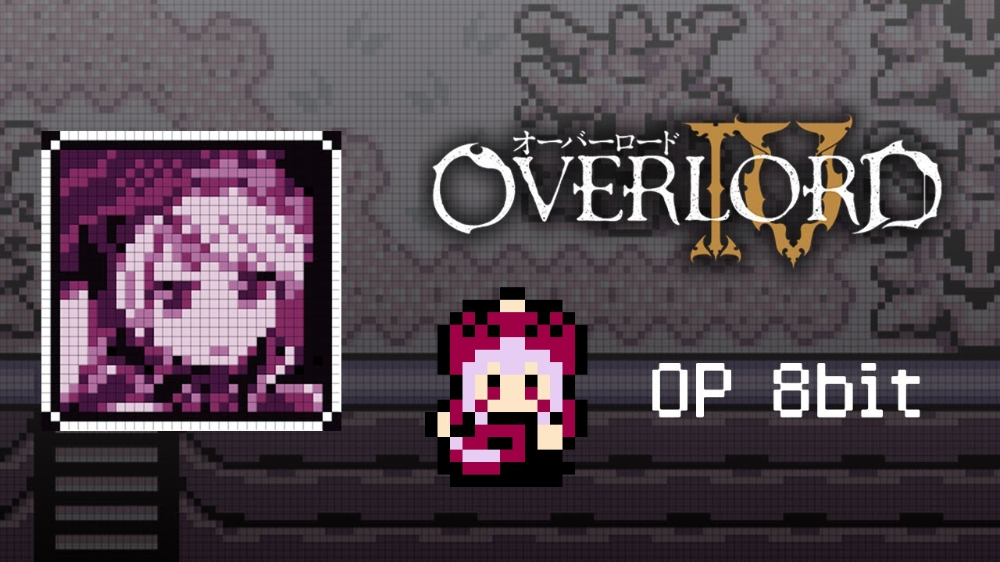 | **Hollow Hunger (Overlord IV OP)** | [Watch on YouTube](https://www.youtube.com/watch?v=AL4s7Y0jBaA) |
| 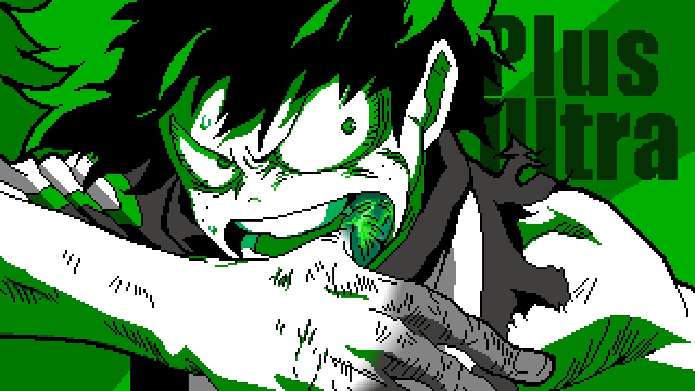 | **Peace Sign (My Hero Academia OP)** | [Watch on YouTube](https://www.youtube.com/watch?v=te5cf77GvNQ) |
| 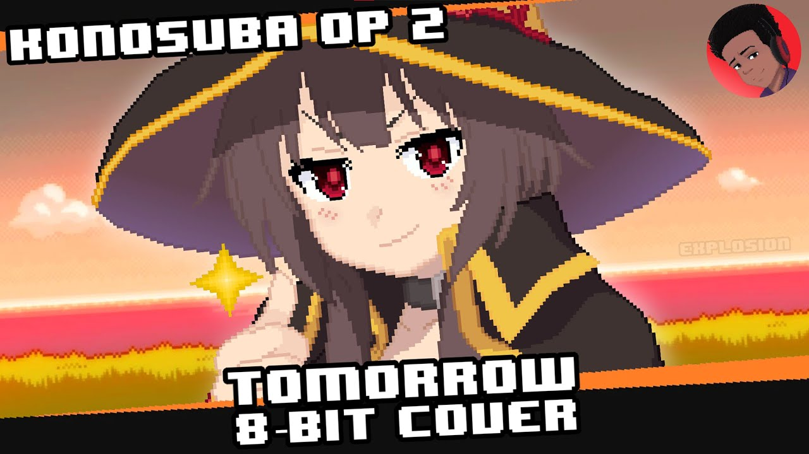 | **Tomorrow (Konosuba OP 2)** | [Watch on YouTube](https://www.youtube.com/watch?v=Gz3IigSi0a4) |
| 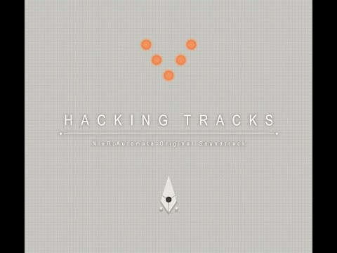 | **Weight of the World (8-bit)** | [Watch on YouTube](https://www.youtube.com/watch?v=mYxn_5kJANA) |
| 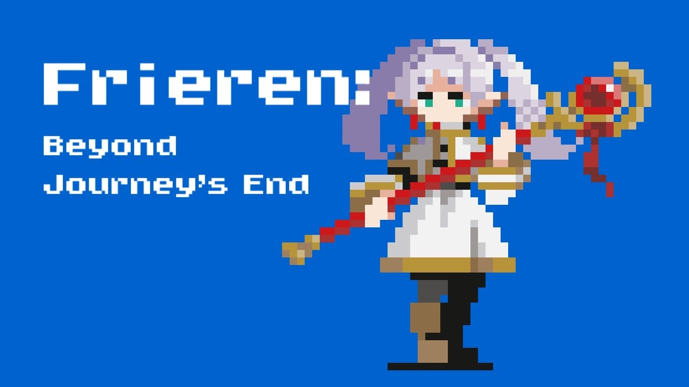 | **YUSHA (Frieren OP)** | [Watch on YouTube](https://www.youtube.com/watch?v=vtUAsicQ1mY) |
| 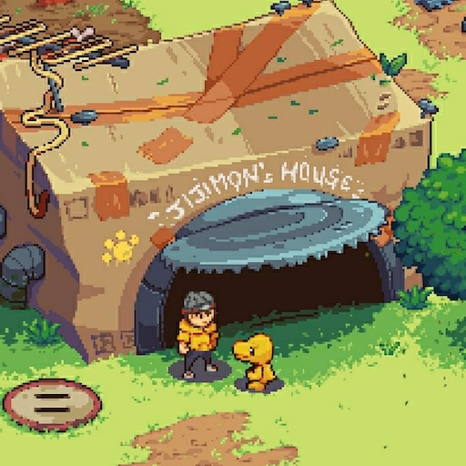 | **File City Day (Digimon World)** | [Watch on YouTube](https://www.youtube.com/watch?v=A4VMnx5aAjY) |

---

## 📄 License & Contributing

Contributions are what make the open-source community such an amazing place to learn, inspire, and create. Any contributions you make are **greatly appreciated**.

1. Fork the Project.
2. Create your Feature Branch (`git checkout -b feature/AmazingFeature`).
3. Commit your Changes (`git commit -m 'Add some AmazingFeature'`).
4. Push to the Branch (`git push origin feature/AmazingFeature`).
5. Open a Pull Request.

This project is open-source under the [MIT License](LICENSE). Give it a ⭐️ if you love it!
